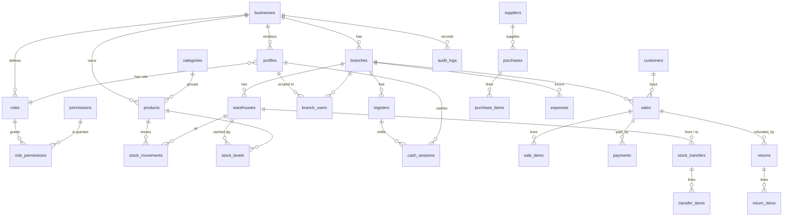

# Database

## ERD

## Migration plan
| File | Content |
|---|---|
| 0001 | extensions, `app` schema, identity helpers, `require_ctx`, function hardening |
| 0002 | businesses, branches, warehouses, registers, roles, permissions, profiles, audit log, gap-free numbering |
| 0003 | categories, products, customers, suppliers, stock ledger + cache trigger |
| 0004 | cash sessions, sales, lines, payments, returns |
| 0005 | purchases, transfers, expenses |
| 0006 | permission catalog, role seeding, bootstrap, staff RPCs, **all RLS policies**, audit triggers |
| 0007 | POS RPCs: open/close session, create sale, refund |
| 0008 | inventory RPCs: receive, adjust, transfers |
| 0009 | low-stock view, stock search, report, realtime publication, cost-column lockdown, grants |
| 0010 | atomic branch creation |
| 0011 | export auditing |

## Indexing notes
`stock_levels(business_id, branch_id)`, `sales(business_id, branch_id, created_at desc)`, trigram index on `products.name`, partial unique indexes for one open session per register, one default warehouse per branch, unique barcode per business, unique delivery ref per supplier.

## RLS summary
Tenant-wide read: branches, warehouses, registers, categories, products. Permission + branch scoped read: stock, movements, sales (own vs all), purchases, transfers, expenses, cash sessions. Direct client writes only for: products, categories, customers, suppliers, branches, warehouses, registers, expenses (insert), business settings. Everything else is RPC-only.

## Offboarding / bulk delete
Append-only triggers block deletes by design. To purge a tenant after contract end, export first, then in a controlled maintenance session use `set session_replication_role = replica;` (superuser), delete, and record the action in your ops log.

## Adding a column to `products`
Because `cost` is withheld at column level, new product columns need `grant select (new_col) on public.products to authenticated;` in the same migration.
